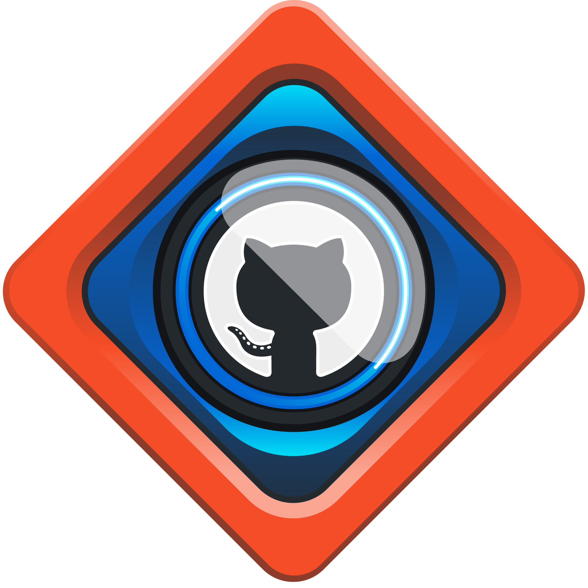

# Projetos DIO

> Repositório para compartilhamento do conhecimento adquirido junto à plataforma da [DIO.me](https://dio.me).

## BOOTCAMPS :trophy:

## CERTIFICADOS :1st_place_medal:

[⬆ Voltar ao topo](#Projetos-DIO)
